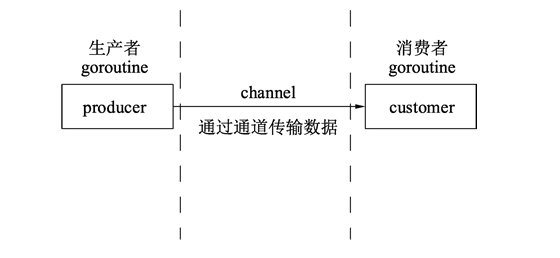
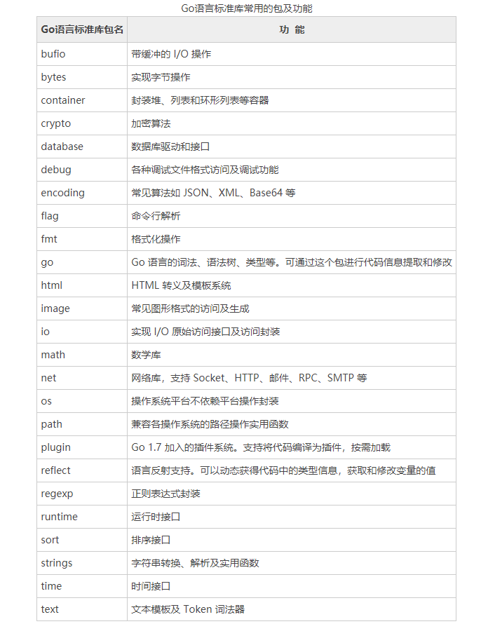

# Lession of GO

    http://c.biancheng.net/golang/intro/

# GO is a Compile-type language

    1.Create a .go file to code
    2.Save 
    3.Compile
    4.Run .go file

    Python,Ruby and Java do not need compile, Go need but Go born with compiler.

# erupt simultaneously（并发）

    GO is a language which suits to execute high erupt simultaneously mission and owns good quality of I/O volume.

    High erupt simultaneously bases on goroutine.

    Between multiple goroutines, messages transfered by channel leads to two concepts of Producer and Customer.
 
    

# Example Projects produced by GO

    Docker https://github.com/docker/docker
    Kubernetes https://github.com/kubernetes/kubernetes
    etcd https://github.com/coreos/etcd
    beego, martini, delve, ...

# Standard Liberary

    

