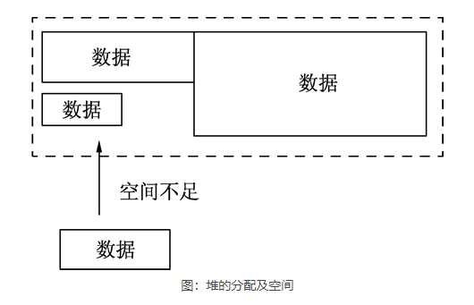

# Variable

    Var a int

    var b string

    var c []float32 - 声明一个32 位浮点切片类型的变量，浮点切片表示由多个浮点类型组成的数据结构

    var d func() bool - 声明一个返回值为布尔类型的函数变量，这种形式一般用于回调函数，即将函数以变量的形式保存下来，在需要的时候重新调用这个函数

    var e struct{
        x int
    }
        - 声明一个结构体类型的变量，这个结构体拥有一个整型的 x 字段
    
## Batch variables defining

    var (
        a int
        b string
        c []float32
        d func() bool
        e struct{
            x int
        }
    )

# Variable-Initialized

    Varibales automaticlly get value when define them, eg:
        int and float defalut 0
        string default ''
        bool default bool
        slice,func,pointer(指针) default nil

# Variable type by derivation(推导)

    var hp = 100
        hp type is same as 100 

# Short variables defined and initialized

    hp := 100
        cannot exist 'var hp int' before this statement

    eg:
        conn,err := net.Dial('tcp','127.0.0.1:8080')
        conn,err2 := net.Dial('tcp','127.0.0.1:8080')
            left-variables must exist one new at least

# Multiple Assignment(赋值)

    eg-1:
        var a int = 100
        var b int = 200
        b,a = a,b

    eg-2: (排序)
        type IntSlice []int

        func (p IntSlice) Len () int         {return len(p)}
        func (p IntSlice) Less(i,j int) bool {return p[i] < p[j]}
        func (p IntSlice) Swap(i,j int)      {p[i],p[j] = p[j],p[i]}

# Anonymous Variable (匿名变量)

    _  --> do not accept value
    eg:
        func GetData() (int,int) {
            return 100,200
        } 

        a,_ := GetData()
        _,b := GetData()

        fmt.PrintIn(a,b)

        $ 100 200

    匿名变量不占用命名空间，不会分配内存。匿名变量与匿名变量之间也不会因为多次声明而无法使用

# Type of Int

## According to size

    int8,int16,int32,int64

## According to sign(符号)

    uint8,uint16,uint32,uint63
        -- no sign int

    uint8 -- is the 'byte' we knew
    int16 -- is the 'short' in C-language
    int63 -- is the 'long' in C-language

## Automaticlly map with platform

    int and uint can do 

        逻辑对整型范围没有特殊需求。例如，对象的长度使用内建 len() 函数返回，这个长度可以根据不同平台的字节长度进行变化。实际使用中，切片或 map 的元素数量等都可以用 int 来表示。

    sometime we cannot use int or uint:

        反之，在二进制传输、读写文件的结构描述时，为了保持文件的结构不会受到不同编译目标平台字节长度的影响，不要使用 int 和 uint。  

# Type of Float

    Go-Language supports two types of float
        float32 and float63 which follow IEEE754

    float32:
        Max-Size: 3.4e38
        Can be defined by a constant(常量): math.MaxFloat32

    float64:
        Max-Size: 1.8e308
        Can be defined by a constant: math.MaxFloat64

    eg:
        fmt.Printf('%.2f\n',math.Pi)
        $ 3.14

# Output images of Sin function

## Function of Sin

    Function Sin supplied by package of math
        -- math.Sin

    Parameters of Sin:
        -- float64

    Return of Sin:
        -- float64

    According to actual, can turnover them

## Image

    Standard Liberary can access to images and output multiple types of image file such as JPEG,PNG,GIF and so on

    eg:
        package main

        import (
            "image"
            "image/color"
            "image/png"
            "log"
            "math"
            "os"
        )

        func main() {

            // 图片大小
            const size = 300
            // 根据给定大小创建灰度图
            pic := image.NewGray(image.Rect(0, 0, size, size))

            // 遍历每个像素
            for x := 0; x < size; x++ {
                for y := 0; y < size; y++ {
                    // 填充为白色
                    pic.SetGray(x, y, color.Gray{255})
                }
            }

            // 从0到最大像素生成x坐标
            for x := 0; x < size; x++ {

                // 让sin的值的范围在0~2Pi之间
                s := float64(x) * 2 * math.Pi / size

                // sin的幅度为一半的像素。向下偏移一半像素并翻转
                y := size/2 - math.Sin(s)*size/2

                // 用黑色绘制sin轨迹
                pic.SetGray(x, int(y), color.Gray{0})
            }

            // 创建文件
            file, err := os.Create("sin.png")

            if err != nil {
                log.Fatal(err)
            }
            // 使用png格式将数据写入文件
            png.Encode(file, pic) //将image信息写入文件中

            // 关闭文件
            file.Close()
        }

# Type of bool

    Go 语言中不允许将整型强制转换为布尔型

        var n bool
        fmt.Println(int(n) * 2)

        $ cannot convert n (type bool) to type int

    布尔型无法参与数值运算，也无法与其他类型进行转换

# String 

    str := "hello world"

    regular escape symbol

        \r	回车符（返回行首）
        \n	换行符（直接跳到下一行的同列位置）
        \t	制表符
        \'	单引号
        \"	双引号
        \\	反斜杠

    define multiple rows of string

        在源码中，将字符串的值以双引号书写的方式是字符串的常见表达方式，被称为字符串字面量（string literal）。这种双引号字面量不能跨行。如果需要在源码中嵌入一个多行字符串时，就必须使用 ` 字符，代码如下：
            const str = ` 第一行
            第二行
            第三行
            \r\n
            `
            fmt.Println(str) 

            $ 第一行
            第二行
            第三行
            \r\n

# byte and rune

    Two types of character in GO:

        uint8(byte) represents one char in ASCII
        rune represents one char of UTF-8 and rune is actually int32

    使用 fmt.Printf 中的%T动词可以输出变量的实际类型

# Convert type of data

    T(espression)

        T - which type you wanna convert into
        expression - include variables,complex operator(算子),return value of func and so on

# Pointer(指针)

    Two core concepts of pointer in GO
        Type-Pointer:
            类型指针，允许对这个指针类型的数据进行修改。传递数据使用指针，而无须拷贝数据。类型指针不能进行偏移和运算。

        Slice:
            切片，由指向起始元素的原始指针、元素数量和容量组成。   

        切片比原始指针具备更强大的特性，更为安全。切片发生越界时，运行时会报出宕机，并打出堆栈，而原始指针只会崩溃。

## Address and Type of Pointer

    Varriable has own address when it run and this address represents the position variable in Memory(内存)

    Use & for getting address:
        ptr := &v    // v的类型为T

        其中 v 代表被取地址的变量，被取地址的 v 使用 ptr 变量进行接收，ptr 的类型就为*T，称做 T 的指针类型。*代表指针。

        eg:
            package main

            import (
                "fmt"
            )

            func main() {
                var cat int = 1
                var str string = "banana"
                fmt.Printf("%p %p", &cat, &str)
            }

            $ 0xc042052088 0xc0420461b0

            使用 fmt.Printf 的动词%p输出 cat 和 str 变量取地址后的指针值，指针值带有0x的十六进制前缀。

            输出值在每次运行是不同的，代表 cat 和 str 两个变量在运行时的地址。

            在 32 位平台上，将是 32 位地址；64 位平台上是 64 位地址。

            提示：变量、指针和地址三者的关系是：每个变量都拥有地址，指针的值就是地址。

## Get value of Pointer points to from itself

    在对普通变量使用&操作符取地址获得这个变量的指针后，可以对指针使用*操作，也就是指针取值，代码如下:

        package main

        import (
            "fmt"
        )

        func main() {

            // 准备一个字符串类型
            var house = "Malibu Point 10880, 90265"

            // 对字符串取地址, ptr类型为*string
            ptr := &house

            // 打印ptr的类型
            fmt.Printf("ptr type: %T\n", ptr)

            // 打印ptr的指针地址
            fmt.Printf("address: %p\n", ptr)

            // 对指针进行取值操作
            value := *ptr

            // 取值后的类型
            fmt.Printf("value type: %T\n", value)

            // 指针取值后就是指向变量的值
            fmt.Printf("value: %s\n", value)

        }

        $ ptr type: *string
        address: 0xc0420401b0
        value type: string
        value: Malibu Point 10880, 90265

    取地址操作符&和取值操作符*是一对互补操作符，&取出地址，*根据地址取出地址指向的值。

    变量、指针地址、指针变量、取地址、取值的相互关系和特性如下：
        对变量进行取地址（&）操作，可以获得这个变量的指针变量。
        指针变量的值是指针地址。
        对指针变量进行取值（*）操作，可以获得指针变量指向的原变量的值。

        v -- variable with value
        &v -- address of this variable
        *(&v) -- get value of this address
       
        *T -- such as *int, *string, ... reprensent Pointer-Types
        
        eg:
            var s string
            var ss *string

            &s like as ss
            *(&s) like as *ss

## Modify value by Pointer

    code-1:

        package main

        import "fmt"

        // 交换函数
        func swap(a, b *int) {

            // 取a指针的值, 赋给临时变量t
            t := *a

            // 取b指针的值, 赋给a指针指向的变量
            *a = *b

            // 将a指针的值赋给b指针指向的变量
            *b = t
        }

        func main() {

        // 准备两个变量, 赋值1和2
            x, y := 1, 2

            // 交换变量值
            swap(&x, &y)

            // 输出变量值
            fmt.Println(x, y)
        }

        $ 2 1

    code-2:

        package main

        // 导入系统包
        import (
            "flag"
            "fmt"
        )

        // 定义命令行参数
        var mode = flag.String("mode", "", "process mode")

        func main() {

            // 解析命令行参数
            flag.Parse()

            // 输出命令行参数
            fmt.Println(*mode)
        } 

        $ go run flagparse.go --mode=fast
        $ fast 

        通过 flag.String，定义一个 mode 变量，这个变量的类型是 *string。后面 3 个参数分别如下：
            参数名称：在给应用输入参数时，使用这个名称。
            参数值的默认值：与 flag 所使用的函数创建变量类型对应，String 对应字符串、Int 对应整型、Bool 对应布尔型等。
            参数说明：使用 -help 时，会出现在说明中。

## new() -- a new way to create Pointer-Variable

    format:
        new(Type)

    eg:
        str := new(string)
        *str = "ninja"

        fmt.Println(*str)  

        new() 函数可以创建一个对应类型的指针，创建过程会分配内存。被创建的指针指向的值为默认值。

# Life period of GO-Variables

## Stack

    concepts:
        Push
        Pop
        
        从栈中取出元素时，只能从栈顶部取出。取出元素后，栈的数量会变少。最先放入的元素总是最后被取出，最后放入的元素总是最先被取出。不允许从栈底获取数据，也不允许对栈成员（除栈顶外的成员）进行任何查看和修改操作。

    relationship between stack and variables:
        栈可用于内存分配，栈的分配和回收速度非常快。下面代码展示栈在内存分配上的作用，代码如下：

            func calc(a, b int) int {
                var c int
                c = a * b

                var x int
                x = c * 10

                return x
            }

        上面的代码在没有任何优化情况下，会进行 c 和 x 变量的分配过程。Go 语言默认情况下会将 c 和 x 分配在栈上，这两个变量在 calc() 函数退出时就不再使用，函数结束时，保存 c 和 x 的栈内存再出栈释放内存，整个分配内存的过程通过栈的分配和回收都会非常迅速。

##  堆(heap)

    堆在内存分配中类似于往一个房间里摆放各种家具，家具的尺寸有大有小。分配内存时，需要找一块足够装下家具的空间再摆放家具。经过反复摆放和腾空家具后，房间里的空间会变得乱七八糟，此时再往空间里摆放家具会存在虽然有足够的空间，但各空间分布在不同的区域，无法有一段连续的空间来摆放家具的问题。此时，内存分配器就需要对这些空间进行调整优化，如下图所示。

    

    堆分配内存和栈分配内存相比，堆适合不可预知大小的内存分配。但是为此付出的代价是分配速度较慢，而且会形成内存碎片。

## Escape Analysis(变量逃逸分析)

    自动决定变量分配方式，提高运行效率。

    Go 语言将这个过程整合到编译器中，命名为“变量逃逸分析”。这个技术由编译器分析代码的特征和代码生命期，决定应该如何堆还是栈进行内存分配，即使程序员使用 Go 语言完成了整个工程后也不会感受到这个过程。

    eg-1:
        package main

        import "fmt"

        // 本函数测试入口参数和返回值情况
        func dummy(b int) int {

            // 声明一个c赋值进入参数并返回
            var c int
            c = b

            return c
        }

        // 空函数, 什么也不做
        func void() {

        }

        func main() {

            // 声明a变量并打印
            var a int

            // 调用void()函数
            void()

            // 打印a变量的值和dummy()函数返回
            fmt.Println(a, dummy(0))
        }

        $ go run -gcflags "-m -l" main.go
        使用 go run 运行程序时，-gcflags 参数是编译参数。其中 -m 表示进行内存分配分析，-l 表示避免程序内联，也就是避免进行程序优化。

        result:
            $ # command-line-arguments
            ./main.go:29:13: a escapes to heap
            ./main.go:29:22: dummy(0) escapes to heap
            ./main.go:29:13: main ... argument does not escape
            0 0

        explain:
            输出第 2 行告知“main 的第 29 行的变量 a 逃逸到堆”。
            第 3 行告知“dummy(0)调用逃逸到堆”。由于 dummy() 函数会返回一个整型值，这个值被 fmt.Println 使用后还是会在其声明后继续在 main() 函数中存在。
            第 4 行，这句提示是默认的，可以忽略。

    上面例子中变量 c 是整型，其值通过 dummy() 的返回值“逃出”了 dummy() 函数。c 变量值被复制并作为 dummy() 函数返回值返回，即使 c 变量在 dummy() 函数中分配的内存被释放，也不会影响 main() 中使用 dummy() 返回的值。c 变量使用栈分配不会影响结果。

    eg-2:
        package main

        import "fmt"

        // 声明空结构体测试结构体逃逸情况
        type Data struct {
        }

        func dummy() *Data {

            // 实例化c为Data类型
            var c Data

            //返回函数局部变量地址
            return &c
        }

        func main() {

            fmt.Println(dummy())
        }

        $ go run -gcflags "-m -l" main.go

        result:
            $ # command-line-arguments
            ./main.go:15:9: &c escapes to heap
            ./main.go:12:6: moved to heap: c
            ./main.go:20:19: dummy() escapes to heap
            ./main.go:20:13: main ... argument does not escape
            &{}

    注意第 4 行出现了新的提示：将 c 移到堆中。这句话表示，Go 编译器已经确认如果将 c 变量分配在栈上是无法保证程序最终结果的。如果坚持这样做，dummy() 的返回值将是 Data 结构的一个不可预知的内存地址。这种情况一般是 C/C++ 语言中容易犯错的地方：引用了一个函数局部变量的地址。

    Go 语言最终选择将 c 的 Data 结构分配在堆上。然后由垃圾回收器去回收 c 的内存。

## Conclusion

    在使用 Go 语言进行编程时，Go 语言的设计者不希望开发者将精力放在内存应该分配在栈还是堆上的问题。编译器会自动帮助开发者完成这个纠结的选择。但变量逃逸分析也是需要了解的一个编译器技术，这个技术不仅用于 Go 语言，在 Java 等语言的编译器优化上也使用了类似的技术。

    编译器觉得变量应该分配在堆和栈上的原则是：
        变量是否被取地址。
        变量是否发生逃逸。

# Const(常量)

    const p = 3
    const (
        a = 2
        b = 1 
    )

# Monitor-enum(模拟枚举)

    Go 语言中现阶段没有枚举，可以使用 const 常量配合 iota 模拟枚举，请看下面的代码：

        type Weapon int

        const (
            Arrow Weapon = iota    // 开始生成枚举值, 默认为0
            Shuriken
            SniperRifle
            Rifle
            Blower
        )

        // 输出所有枚举值
        fmt.Println(Arrow, Shuriken, SniperRifle, Rifle, Blower)

        // 使用枚举类型并赋初值
        var weapon Weapon = Blower
        fmt.Println(weapon)

        $ 1 2 3 4
        4

        explain:
            第 1 行中将 int 定义为 Weapon 类型，就像枚举类型其实本质是一个 int 一样。当然，某些情况下，如果需要 int32 和 int64 的枚举，也是可以的。

            第4行中，将 Array 常量的类型标识为 Weapon，这样标识后，const 下方的常量可以是默认类型的，默认时，默认使用前面指定的类型作为常量类型。该行使用 iota 进行常量值自动生成。iota 起始值为 0，一般情况下也是建议枚举从 0 开始，让每个枚举类型都有一个空值，方便业务和逻辑的灵活使用。

            一个 const 声明内的每一行常量声明，将会自动套用前面的 iota 格式，并自动增加。这种模式有点类似于电子表格中的单元格自动填充。只需要建立好单元格之间的变化关系，拖动右下方的小点就可以自动生成单元格的值。

    当然，iota 不仅只生成每次增加 1 的枚举值。我们还可以利用 iota 来做一些强大的枚举常量值生成器。下面的代码可以方便生成标志位常量：

        const (
            FlagNone = 1 << iota
            FlagRed
            FlagGreen
            FlagBlue
        )

        fmt.Printf("%d %d %d\n", FlagRed, FlagGreen, FlagBlue)
        fmt.Printf("%b %b %b\n", FlagRed, FlagGreen, FlagBlue)

        $ 2 4 8
        10 100 1000

        explain:
            第 2 行中 iota 使用了一个移位操作，每次将上一次的值左移一位，以做出每一位的常量值。
            第 8 行，将 3 个枚举按照常量输出，分别输出 2、4、8，都是将 1 每次左移一位的结果。
            第 9 行，将枚举值按二进制格式输出，可以清晰地看到每一位的变化。

## 将枚举值转换为字符串

    package main

    import "fmt"

    // 声明芯片类型
    type ChipType int

    const (
        None ChipType = iota
        CPU    // 中央处理器
        GPU    // 图形处理器
    )

    func (c ChipType) String() string {
        switch c {
        case None:
            return "None"
        case CPU:
            return "CPU"
        case GPU:
            return "GPU"
        }

        return "N/A"
    }

    func main() {

        // 输出CPU的值并以整型格式显示
        fmt.Printf("%s %d", CPU, CPU)
    }

    $ CPU 1

    explain:
        第 6 行，将 int 声明为 ChipType 芯片类型。
        第 9 行，将 const 里定义的一句常量值设为 ChipType 类型，且从 0 开始，每行值加 1。
        第 14 行，定义 ChipType 类型的方法 String()，返回字符串。
        第 15～22 行，使用 switch 语句判断当前的 ChitType 类型的值，返回对应的字符串。
        第 30 行，输出 CPU 的值并按整型格式输出。

            

